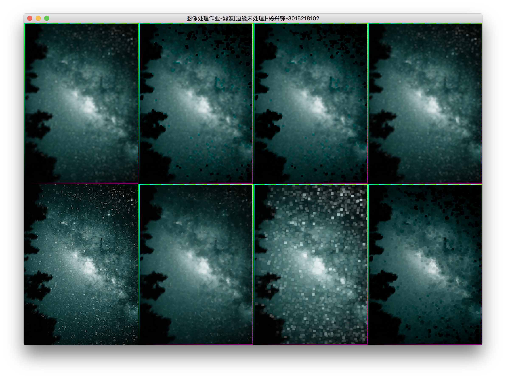
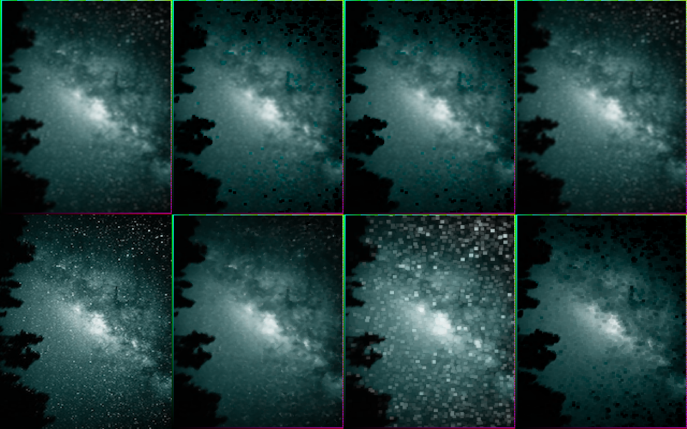

##   图形处理-滤波

### 杨兴锋

### 3015218102

## 1. 程序运行结果



## 2. 滤波结果



### 说明：结果排列

| 算数均值 | 几何均值 |  协波   | 逆协波[Q=0] |
| :--: | ---- | :---: | :------: |
|  原图  | 中值滤波 | 最大值滤波 |  最小值滤波   |
## 3. 代码

### 1. 技术实现：C++ openGL glfw

### 2.平台 OSX 

### 3. 编译方式 cmake[代码含有CmakeList.txt]

### 4. 代码

``` cmake
# CmakeList.txt
cmake_minimum_required(VERSION 3.6)
project(gp_hw_02)

set(CMAKE_CXX_STANDARD 11)

set(SOURCE_FILES
        main.cpp
        Board.cpp Board.hpp
        StateBase.cpp StateBase.hpp
        Rectangle.cpp Rectangle.hpp
        PixelMap.cpp PixelMap.h
        ColorRGB.cpp ColorRGB.h
        Pixel.cpp Pixel.h Math.cpp Math.h)


INCLUDE_DIRECTORIES(/usr/local/Cellar/glew/2.0.0/include /usr/local/Cellar/glfw/3.2.1/include /System/Library/Frameworks/OpenGL.framework/Headers)

LINK_DIRECTORIES(/usr/local/Cellar/glew/2.0.0/lib /usr/local/Cellar/glfw/3.2.1/lib /System/Library/Frameworks/OpenGL.framework/Libraries)

LINK_LIBRARIES(gl glew glfw GLU)


add_executable(gp_hw_02 ${SOURCE_FILES})
```


```C++
//main.cpp

#include "Board.hpp"

int main(int argc, const char * argv[]) {
    Board* board = new Board("图像处理作业-滤波[边缘未处理]-杨兴锋-3015218102",640,480,new ColorRGB(255,255,255));
    board->setEventHandling();
    board->run();
    return 0;
}
```

``` c++
//Board.hpp
//
//  Board.hpp
//  ai_hw
//
//  Created by neroyang on 2017/10/10.
//  Copyright © 2017年 neroyang. All rights reserved.
//

#ifndef Board_hpp
#define Board_hpp

#include <stdio.h>
#include <iostream>
#include <GL/glew.h>
#include <GLFW/glfw3.h>
#include "StateBase.hpp"
#include "PixelMap.h"
#include <vector>

class Board : public StateBase{
private:

    char* title;
    int width;
    int height;
    ColorRGB* backGround;


    std::vector<std::vector<Pixel*>> pixels;
    std::vector<std::vector<Pixel*>> pixels_zhong;
    std::vector<std::vector<Pixel*>> pixels_zuida;
    std::vector<std::vector<Pixel*>> pixels_zuixiao;

    std::vector<std::vector<Pixel*>> pixels_suanshu;
    std::vector<std::vector<Pixel*>> pixels_jihe;
    std::vector<std::vector<Pixel*>> pixels_xie;
    std::vector<std::vector<Pixel*>> pixels_niexie;


    PixelMap* yuantu;       //原图
    PixelMap* zhongzhi;     //中值滤波
    PixelMap* zuidazhi;     //最大值
    PixelMap* zuixiaozhi;   //最小值

    PixelMap* suanshu;      //算数均值
    PixelMap* jihe;         //几何均值
    PixelMap* xie;          //谐波
    PixelMap* nixie;        //逆谐波

    
public:
    Board(char *title, int width, int height, ColorRGB *backGround);


    void update();
    
    virtual void keycallback(
                             GLFWwindow *window,
                             int key,
                             int scancode,
                             int action,
                             int mods);

    virtual  void framebuffer_size_callback(GLFWwindow *window, int w, int h);

    void Render(void);
    
    int run();
};

#endif /* Board_hpp */

```

```c++
// Board.cpp
//
//  Board.cpp
//  ai_hw
//
//  Created by neroyang on 2017/10/10.
//  Copyright © 2017年 neroyang. All rights reserved.
//

#include "Board.hpp"
#include <time.h>
#include <glu.h>
#include "Rectangle.hpp"
#include <algorithm>
#include <cmath>
#include "math.h"


Board::Board(char* title, int width, int height, ColorRGB *backGround) : title(title), width(width), height(height), backGround(backGround) {
    yuantu = new PixelMap(0,0,this->width/4,this->height/2,new ColorRGB(255,255,0));
    for(int i = 0;i<this->width/4;i++){
        std::vector<Pixel*> pp;
        for(int j = 0;j<this->height/2;j++){
            pp.push_back(new Pixel(i,j,new ColorRGB(i,j,(i*j)%255)));
        }
        pixels.push_back(pp);
    }

    yuantu->setPixelMap(pixels);
    yuantu->normalize(width,height);

    zhongzhi =      new PixelMap((this->width/4),0,this->width/4,this->height/2,new ColorRGB(0,255,0));
    for(int i = 0;i<this->width/4;i++){
        std::vector<Pixel*> pp;
        for(int j = 0;j<this->height/2;j++){
            pp.push_back(new Pixel((this->width/4)+i,j,new ColorRGB(i,j,(i*j)%255)));
        }
        pixels_zhong.push_back(pp);
    }

    for(int i  = 0;i<this->zhongzhi->getWidth();i++){
        for(int j = 0;j<this->zhongzhi->getHeight();j++){
            if(i>1 && i<this->zhongzhi->getWidth()-1 && j>1 && j<this->zhongzhi->getHeight()-1) {
                float gray[9];
                int index = 0;
                for(int r = -1;r<2;r++){
                    for(int c = -1;c<2;c++){
                        gray[index] = pixels[i+r][j+c]->getColor()->R()*0.03f +
                                pixels[i+r][j+c]->getColor()->G()*0.59f+
                                pixels[i+r][j+c]->getColor()->B()*0.11f;
                        index++;
                    }
                }
                Math* math = new Math();
                int len=sizeof(gray)/sizeof(int);
                math->quickSort(gray,0,len-1);
                float current_gray = gray[4]; //    灰度值中位数


                for(int r = -1;r<2;r++){
                    for(int c = -1;c<2;c++){
                        if(current_gray == pixels[i+r][j+c]->getColor()->R()*0.03f +
                                           pixels[i+r][j+c]->getColor()->G()*0.59f+
                                           pixels[i+r][j+c]->getColor()->B()*0.11f){

                            pixels_zhong[i][j]->setColor(pixels[i+r][j+c]->getColor());
                        }
                    }
                }
            }
        }
    }
    zhongzhi->setPixelMap(pixels_zhong);
    zhongzhi->normalize(width,height);


    zuidazhi =      new PixelMap((this->width/4)*2,0,this->width/4,this->height/2,new ColorRGB(255,0,0));
    for(int i = 0;i<this->width/4;i++){
        std::vector<Pixel*> pp;
        for(int j = 0;j<this->height/2;j++){
            pp.push_back(new Pixel((this->width/4)*2+i,j,new ColorRGB(i,j,(i*j)%255)));
        }
        pixels_zuida.push_back(pp);
    }

    for(int i  = 0;i<this->zuidazhi->getWidth();i++){
        for(int j = 0;j<this->zuidazhi->getHeight();j++){
            if(i>1 && i<this->zuidazhi->getWidth()-1 && j>1 && j<this->zuidazhi->getHeight()-1) {
                float gray[9];
                int index = 0;
                for(int r = -1;r<2;r++){
                    for(int c = -1;c<2;c++){
                        gray[index] = pixels[i+r][j+c]->getColor()->R()*0.03f +
                                pixels[i+r][j+c]->getColor()->G()*0.59f+
                                pixels[i+r][j+c]->getColor()->B()*0.11f;
                        index++;
                    }
                }

                Math* math = new Math();
                int len=sizeof(gray)/sizeof(int);
                math->quickSort(gray,0,len-1);

                float current_gray = gray[8];
                for(int r = -1;r<2;r++){
                    for(int c = -1;c<2;c++){
                        if(current_gray == pixels[i+r][j+c]->getColor()->R()*0.03f +
                                                   pixels[i+r][j+c]->getColor()->G()*0.59f+
                                                   pixels[i+r][j+c]->getColor()->B()*0.11f){

                            pixels_zuida[i][j]->setColor(pixels[i+r][j+c]->getColor());
                        }
                    }
                }
            }
        }
    }
    zuidazhi->setPixelMap(pixels_zuida);
    zuidazhi->normalize(width,height);

    zuixiaozhi =    new PixelMap((this->width/4)*3,0,this->width/4,this->height/2,new ColorRGB(0,255,255));
    for(int i = 0;i<this->width/4;i++){
        std::vector<Pixel*> pp;
        for(int j = 0;j<this->height/2;j++){
            pp.push_back(new Pixel((this->width/4)*3+i,j,new ColorRGB(i,j,(i*j)%255)));
        }
        pixels_zuixiao.push_back(pp);
    }


    for(int i  = 0;i<this->zuixiaozhi->getWidth();i++){
        for(int j = 0;j<this->zuixiaozhi->getHeight();j++){
            if(i>1 && i<this->zuixiaozhi->getWidth()-1 && j>1 && j<this->zuidazhi->getHeight()-1) {
                float gray[9];
                int index = 0;
                for(int r = -1;r<2;r++){
                    for(int c = -1;c<2;c++){
                        gray[index] = pixels[i+r][j+c]->getColor()->R()*0.03f +
                                pixels[i+r][j+c]->getColor()->G()*0.59f+
                                pixels[i+r][j+c]->getColor()->B()*0.11f;
                        index++;
                    }
                }

                Math* math = new Math();
                int len=sizeof(gray)/sizeof(int);
                math->quickSort(gray,0,len-1);

                float current_gray = gray[0];
                for(int r = -1;r<2;r++){
                    for(int c = -1;c<2;c++){
                        if(current_gray == pixels[i+r][j+c]->getColor()->R()*0.03f +
                                                   pixels[i+r][j+c]->getColor()->G()*0.59f+
                                                   pixels[i+r][j+c]->getColor()->B()*0.11f){

                            pixels_zuixiao[i][j]->setColor(pixels[i+r][j+c]->getColor());
                        }
                    }
                }
            }
        }
    }
    zuixiaozhi->setPixelMap(pixels_zuixiao);
    zuixiaozhi->normalize(width,height);


    suanshu =       new PixelMap(0,this->height/2,this->width/4,this->height/2,new ColorRGB(255,255,0));
    for(int i = 0;i<this->width/4;i++){
        std::vector<Pixel*> pp;
        for(int j = 0;j<this->height/2;j++){
            pp.push_back(new Pixel(i,j+this->height/2,new ColorRGB(i,j,(i*j)%255)));
        }
        pixels_suanshu.push_back(pp);

    }

    for(int i  = 0;i<this->suanshu->getWidth();i++){
        for(int j = 0;j<this->suanshu->getHeight();j++){
            if(i>1 && i<this->suanshu->getWidth()-1 && j>1 && j<this->suanshu->getHeight()-1) {
                float R = 0.0f,G = 0.0f,B = 0.0f;
                for(int r = -1;r<2;r++){
                    for(int c = -1;c<2;c++){
                        R+=pixels[i+r][j+c]->getColor()->R();
                        G+=pixels[i+r][j+c]->getColor()->G();
                        B+=pixels[i+r][j+c]->getColor()->B();
                    }
                }
                R = (R/9.0f)*255.0f;
                G = (G/9.0f)*255.0f;
                B = (B/9.0f)*255.0f;

                pixels_suanshu[i][j]->setColor(new ColorRGB(R,G,B));
            }
        }
    }

    suanshu->setPixelMap(pixels_suanshu);
    suanshu->normalize(width,height);


    jihe =          new PixelMap((this->width/4),this->height/2,this->width/4,this->height/2,new ColorRGB(0,255,255));
    for(int i = 0;i<this->width/4;i++){
        std::vector<Pixel*> pp;
        for(int j = 0;j<this->height/2;j++){
            pp.push_back(new Pixel((this->width/4)+i,j+this->height/2,new ColorRGB(i,j,(i*j)%255)));
        }
        pixels_jihe.push_back(pp);
    }

    for(int i  = 0;i<this->jihe->getWidth();i++){
        for(int j = 0;j<this->jihe->getHeight();j++){
            if(i>1 && i<this->jihe->getWidth()-1 && j>1 && j<this->jihe->getHeight()-1) {
                float R = 1.0f,G = 1.0f,B = 1.0f;
                for(int r = -1;r<2;r++){
                    for(int c = -1;c<2;c++){
                        R*=(pixels[i+r][j+c]->getColor()->R()*255.0f);
                        G*=(pixels[i+r][j+c]->getColor()->G()*255.0f);
                        B*=(pixels[i+r][j+c]->getColor()->B()*255.0f);
                    }
                }

                R = pow(R,1.0f/9.0f);
                G = pow(G,1.0f/9.0f);
                B = pow(B,1.0f/9.0f);

                pixels_jihe[i][j]->setColor(new ColorRGB(R,G,B));
            }
        }
    }
    jihe->setPixelMap(pixels_jihe);
    jihe->normalize(width,height);

    xie =           new PixelMap((this->width/4)*2,this->height/2,this->width/4,this->height/2,new ColorRGB(255,0,255));
    for(int i = 0;i<this->width/4;i++){
        std::vector<Pixel*> pp;
        for(int j = 0;j<this->height/2;j++){
            pp.push_back(new Pixel((this->width/4)*2+i,j+this->height/2,new ColorRGB(i,j,(i*j)%255)));
        }
        pixels_xie.push_back(pp);
    }

    for(int i  = 0;i<this->xie->getWidth();i++){
        for(int j = 0;j<this->xie->getHeight();j++){
            if(i>1 && i<this->xie->getWidth()-1 && j>1 && j<this->xie->getHeight()-1) {
                float R = 0.0f,G = 0.0f,B = 0.0f;
                for(int r = -1;r<2;r++){
                    for(int c = -1;c<2;c++){
                        R+=(1.0f/pixels[i+r][j+c]->getColor()->R());
                        G+=(1.0f/pixels[i+r][j+c]->getColor()->G());
                        B+=(1.0f/pixels[i+r][j+c]->getColor()->B());
                    }
                }
                R = (9.0f/R)*255.0f;
                G = (9.0f/G)*255.0f;
                B = (9.0f/B)*255.0f;
                pixels_xie[i][j]->setColor(new ColorRGB(R,G,B));
            }
        }
    }
    xie->setPixelMap(pixels_xie);
    xie->normalize(width,height);

    nixie =         new PixelMap((this->width/4)*3,this->height/2,this->width/4,this->height/2,new ColorRGB(255,255,255));
    for(int i = 0;i<this->width/4;i++){
        std::vector<Pixel*> pp;
        for(int j = 0;j<this->height/2;j++){
            pp.push_back(new Pixel((this->width/4)*3+i,j+this->height/2,new ColorRGB(i,j,(i*j)%255)));
        }
        pixels_niexie.push_back(pp);
    }

    for(int i  = 0;i<this->nixie->getWidth();i++){
        for(int j = 0;j<this->nixie->getHeight();j++){
            if(i>1 && i<this->nixie->getWidth()-1 && j>1 && j<this->nixie->getHeight()-1) {
                float R = 0.0f,G =0.0f,B=0.0f,R1 = 0.0f,G1 =0.0f,B1=0.0f;
                float Q = 0;
                for(int r = -1;r<2;r++){
                    for(int c = -1;c<2;c++){
                        R+=(pow(pixels[i+r][j+c]->getColor()->R(),Q));
                        G+=(pow(pixels[i+r][j+c]->getColor()->G(),Q));
                        B+=(pow(pixels[i+r][j+c]->getColor()->B(),Q));
                    }
                }
                for(int r = -1;r<2;r++){
                    for(int c = -1;c<2;c++){
                        R1+=(pow(pixels[i+r][j+c]->getColor()->R(),Q+1.0f));
                        G1+=(pow(pixels[i+r][j+c]->getColor()->G(),Q+1.0f));
                        B1+=(pow(pixels[i+r][j+c]->getColor()->B(),Q+1.0f));
                    }
                }
                R = (R1/R)*255.0f;
                G = (G1/G)*255.0f;
                B = (B1/B)*255.0f;
                pixels_niexie[i][j]->setColor(new ColorRGB(R,G,B));
            }
        }
    }
    nixie->setPixelMap(pixels_niexie);
    nixie->normalize(width,height);
}

void Board::keycallback(GLFWwindow *window, int key, int scancode, int action, int mods) {
    update();
    if (action != GLFW_PRESS)
        return;
    switch (key) {
        case GLFW_KEY_ESCAPE:
            glfwSetWindowShouldClose(window, GL_TRUE);
            break;
        default:
            break;
    }
}

GLfloat ratio = 1.f;

void Board::framebuffer_size_callback(GLFWwindow *window, int w, int h) {
    if (h == 0)
    {
        h = 1;
    }
    if (h > 0) {
        ratio = (float) w / (float) h;
    }

    glViewport(0, 0, w, h);
    this->width = w;
    this->height = h;
    glMatrixMode(GL_PROJECTION);
    glLoadIdentity();
    glMatrixMode(GL_MODELVIEW);

    update();
}


void Board::update() {
    yuantu->render();
    zhongzhi->render();
    zuidazhi->render();
    zuixiaozhi->render();

    suanshu->render();
    jihe->render();
    xie->render();
    nixie->render();

}

void Board::Render() {


        update();
}

int Board::run() {
    GLFWwindow *win;
    if (!glfwInit()) {
        return -1;
    }
    win = glfwCreateWindow(this->width, this->height, this->title, NULL, NULL);

    if (!win) {
        glfwTerminate();
        exit(EXIT_FAILURE);
    }
    if (!glewInit()) {
        return -1;
    }

    framebuffer_size_callback(win,this->width,this->height);

    glfwSetKeyCallback(win, StateBase::keycallback_dispatch);

    glfwSetFramebufferSizeCallback(win, StateBase::framebuffer_size_callback_dispatch);
    glfwMakeContextCurrent(win);

    while (!glfwWindowShouldClose(win)) {
        glClearColor(backGround->R(), backGround->G(), backGround->B(), 1.0f);
        glClear(GL_COLOR_BUFFER_BIT);
        Render();
        glfwSwapBuffers(win);
        glfwPollEvents();
    }
    glfwTerminate();
    exit(EXIT_SUCCESS);
}
```

``` c++
// StateBase.hpp
//
//  statebase.hpp
//  ai_hw
//
//  Created by neroyang on 2017/10/10.
//  Copyright © 2017年 neroyang. All rights reserved.
//

#ifndef statebase_hpp
#define statebase_hpp

#include <stdio.h>
#include <GL/glew.h>
#include <GLFW/glfw3.h>

class StateBase {
public:
    virtual void keycallback(
            GLFWwindow *window,
            int key,
            int scancode,
            int action,
            int mods) = 0;

    virtual void framebuffer_size_callback(GLFWwindow *window, int w, int h) = 0;

    static StateBase *event_handling_instance;

    virtual void setEventHandling() { event_handling_instance = this; }

    static void keycallback_dispatch(
            GLFWwindow *window,
            int key,
            int scancode,
            int action,
            int mods) {
        if (event_handling_instance)
            event_handling_instance->keycallback(window, key, scancode, action, mods);
    }

    static void framebuffer_size_callback_dispatch(GLFWwindow *window, int w, int h) {
        if (event_handling_instance)
            event_handling_instance->framebuffer_size_callback(window, w, h);
    }
};

#endif /* statebase_hpp */

```

```c++
// StateBase.cpp
//
//  statebase.cpp
//  ai_hw
//
//  Created by neroyang on 2017/10/10.
//  Copyright © 2017年 neroyang. All rights reserved.
//

#include "StateBase.hpp"

StateBase * StateBase::event_handling_instance;

```

``` c++
// PixelMap.hpp
//
// Created by neroyang on 2017/10/14.
//

#ifndef GP_HW_02_PIXELMAP_H
#define GP_HW_02_PIXELMAP_H

#include <vector>
#include "ColorRGB.h"
#include "Pixel.h"

class PixelMap {
private:
    int x;
    int y;

    int height;
    int width;

    ColorRGB* backgroundColor;
    std::vector<std::vector<Pixel*>> pixelMap;

public:

    void setPixelMap(std::vector<std::vector<Pixel*>> pixelmap){
        this->pixelMap = pixelmap;
    };

    void normalize(int width,int height);

    std::vector<std::vector<Pixel*>> getPixelMap(){return this->pixelMap;};

    PixelMap(int x,int y,int width, int height, ColorRGB *backgroundColor);

    void render();

    int getWidth(){return this->width;};
    int getHeight(){return this->height;};
};


#endif //GP_HW_02_PIXELMAP_H

```

``` c++
// PixelMap.cpp
//
// Created by neroyang on 2017/10/14.
//

#include "PixelMap.h"


void PixelMap::normalize(int width,int height) {
    for(int i = 0;i<this->width;i++){
        for(int j = 0;j<this->height;j++){
            pixelMap[i][j]->normalize(width,height);
        }
    }
}

void PixelMap::render() {
    for(int i = 0;i<width;i++){
        for(int j = 0;j<height;j++){
            pixelMap[i][j]->render();
        }
    }
}

PixelMap::PixelMap(int x,int y,int width, int height, ColorRGB *backgroundColor) : x(x),y(y),height(height), width(width), backgroundColor(backgroundColor) {
    for(int i = 0;i<width;i++){
        std::vector<Pixel*> pp;
        for(int j = 0;j<height;j++){
            pp.push_back(new Pixel(x+i,y+j,backgroundColor));
        }
        pixelMap.push_back(pp);
    }
}
```

```c++
//ColorRGB.hpp
//
// Created by neroyang on 2017/10/14.
//

#ifndef GP_HW_02_COLORRGB_H
#define GP_HW_02_COLORRGB_H


#include <ostream>

class ColorRGB {
    private:
        unsigned int r;
        unsigned int g;
        unsigned int b;
public:
    ColorRGB(unsigned int r, unsigned int g, unsigned int b);

    float R(){return r/255.0f;};
    float G(){return g/255.0f;};
    float B(){return b/255.0f;}


    bool operator<(const ColorRGB &rhs) const;

    bool operator>(const ColorRGB &rhs) const;

    bool operator<=(const ColorRGB &rhs) const;

    bool operator>=(const ColorRGB &rhs) const;

    bool operator==(const ColorRGB &rhs) const;

    bool operator!=(const ColorRGB &rhs) const;

    friend std::ostream &operator<<(std::ostream &os, const ColorRGB &rgb);
};


#endif //GP_HW_02_COLORRGB_H
```

``` c++
// ColorRGB.cpp
//
// Created by neroyang on 2017/10/14.
//

#include "ColorRGB.h"

ColorRGB::ColorRGB(unsigned int r, unsigned int g, unsigned int b) : r(r), g(g), b(b) {}

bool ColorRGB::operator<(const ColorRGB &rhs) const {
    if (r < rhs.r)
        return true;
    if (rhs.r < r)
        return false;
    if (g < rhs.g)
        return true;
    if (rhs.g < g)
        return false;
    return b < rhs.b;
}

bool ColorRGB::operator>(const ColorRGB &rhs) const {
    return rhs < *this;
}

bool ColorRGB::operator<=(const ColorRGB &rhs) const {
    return !(rhs < *this);
}

bool ColorRGB::operator>=(const ColorRGB &rhs) const {
    return !(*this < rhs);
}


bool ColorRGB::operator==(const ColorRGB &rhs) const {
    return r == rhs.r &&
           g == rhs.g &&
           b == rhs.b;
}

bool ColorRGB::operator!=(const ColorRGB &rhs) const {
    return !(rhs == *this);
}

std::ostream &operator<<(std::ostream &os, const ColorRGB &rgb) {
    os << "r: " << rgb.r << " g: " << rgb.g << " b: " << rgb.b;
    return os;
}


```

``` c++
//Pixel.hpp
//
// Created by neroyang on 2017/10/14.
//

#ifndef GP_HW_02_PIXEL_H
#define GP_HW_02_PIXEL_H


#include "ColorRGB.h"
#include "Rectangle.hpp"

class Pixel {

private:
    int x;
    int y;
    ColorRGB* color;
    Rectangle *rectangle;

public:
    Pixel(int x, int y, ColorRGB *color);


    ColorRGB* getColor(){return this->color;};


    void setColor(ColorRGB* color){this->rectangle->setColor(color->R(),color->G(),color->B());};


    void normalize(int width,int height);


    void render();
};


#endif //GP_HW_02_PIXEL_H

```

``` c++
// Pixel.cpp
//
// Created by neroyang on 2017/10/14.
//

#include "Pixel.h"


Pixel::Pixel(int x, int y, ColorRGB *color) : x(x), y(y), color(color) {
    this->rectangle= new Rectangle(0,0,0,0,color->R(),color->G(),color->B());
}

void Pixel::normalize(int width,int height){
    this->rectangle->setX(-1.0f+(2.0f/width)*this->x);
    this->rectangle->setY(-1.0f+(2.0f/height)*this->y);
    this->rectangle->setWidth((2.0f/width));
    this->rectangle->setHeight((2.0f/height));
}

void Pixel::render() {
    this->rectangle->draw();
}

```

``` c++
// Rectangle.hpp
//
//  Rectangle.hpp
//  ai_hw
//
//  Created by neroyang on 2017/10/10.
//  Copyright © 2017年 neroyang. All rights reserved.
//

#ifndef Rectangle_hpp
#define Rectangle_hpp

#include <stdio.h>
class Rectangle{
private:
    
    float x;
    float y;
    
    float width;
    float height;
    
    float r;
    float g;
    float b;
    
public:
    Rectangle(float x,
              float y,
              float width,
              float height,
              float r,
              float g,
              float b);

    void setX(float x){
        this->x = x;
    };
    void setY(float y){
        this->y = y;
    };
    void setWidth(float width){
        this->width = width;
    };
    void setHeight(float height){
        this->height = height;
    };

    void setColor(float r,float g,float b){
        this->r =r;
        this->g = g;
        this->b = b;
    }

    void draw();
};
#endif /* Rectangle_hpp */

```


``` c++
//Rectangle.cpp
//
//  Rectangle.cpp
//  ai_hw
//
//  Created by neroyang on 2017/10/10.
//  Copyright © 2017年 neroyang. All rights reserved.
//

#include "Rectangle.hpp"
#include <GL/glew.h>
#include <GLFW/glfw3.h>

Rectangle::Rectangle(float x,
                     float y,
                     float width,
                     float height,
                     float r,
                     float g,
                     float b):x(x),y(y),width(width),height(height),r(r),g(g),b(b){
    
}

void Rectangle::draw(){
    glColor3f(r, g, b);
    glBegin(GL_POLYGON);
    {
        glVertex3f(x,    y,      0.0);
        glVertex3f(x+width,  y,      0.0);
        glVertex3f(x+width,  y+height, 0.0);
        glVertex3f(x,    y+height, 0.0);
    }
    glEnd();
}

```

``` c++
// Math.hpp
//
// Created by neroyang on 2017/10/15.
//

#ifndef GP_HW_02_MATH_H
#define GP_HW_02_MATH_H


class Math {

public:
    Math();

    void quickSort(float s[], int l, int r);
};


#endif //GP_HW_02_MATH_H

```

``` c++
// Math.cpp
//
// Created by neroyang on 2017/10/15.
//

#include "Math.h"
void Math::quickSort(float *s, int l, int r) {
        if (l< r)
        {
            int i = l, j = r;
            float x = s[l];
            while (i < j)
            {
                while(i < j && s[j]>= x) // 从右向左找第一个小于x的数
                    j--;
                if(i < j)
                    s[i++] = s[j];
                while(i < j && s[i]< x) // 从左向右找第一个大于等于x的数
                    i++;
                if(i < j)
                    s[j--] = s[i];
            }
            s[i] = x;
            quickSort(s, l, i - 1); // 递归调用
            quickSort(s, i + 1, r);
        }
}

Math::Math() {}

```

#### 新加PNG文件操作类

```c++
// PNGLoader.h
//
// Created by neroyang on 2017/10/15.
//

#ifndef GP_HW_02_PNGLOADER_H
#define GP_HW_02_PNGLOADER_H


#include <vector>
#include "ColorRGB.h"

class PNGLoader {
private:
    int width;
    int height;

    std::vector<std::vector<ColorRGB*>> pixels;

    unsigned char* bgra;


public:


    PNGLoader();

    std::vector<std::vector<ColorRGB*>> getPixelsMap(){return this->pixels;};

    int getWidth(){return this->width;};
    int getHeight(){return this->height;};


    std::vector<std::vector<ColorRGB*>> loadPNG(char* filename);
};


#endif //GP_HW_02_PNGLOADER_H

```

``` c++
// PNGLoader.cpp
//
// Created by neroyang on 2017/10/15.
//

#include <cstdio>
#include <png.h>
#include <iostream>
#include "PNGLoader.h"

std::vector<std::vector<ColorRGB*>> PNGLoader::loadPNG(char *filename) {
    FILE* file = fopen(filename, "rb");

    png_structp png_ptr = png_create_read_struct(PNG_LIBPNG_VER_STRING, 0, 0, 0);

    png_infop info_ptr = png_create_info_struct(png_ptr);

    setjmp(png_jmpbuf(png_ptr));


    png_init_io(png_ptr, file);


    png_read_png(png_ptr, info_ptr, PNG_TRANSFORM_EXPAND, 0);


    int m_width = png_get_image_width(png_ptr, info_ptr);
    int m_height = png_get_image_height(png_ptr, info_ptr);

    this->width = m_width;
    this->height =m_height;

    int color_type = png_get_color_type(png_ptr, info_ptr);


    int size = m_height * m_width * 4;

    this->bgra = new unsigned char[size];

    int pos = 0;


    png_bytep* row_pointers = png_get_rows(png_ptr, info_ptr);


    for(int i = 0; i < m_height; i++)
    {
        std::vector<ColorRGB*> color;
        for(int j = 0; j < (4 * m_width); j += 4)
        {
            this->bgra[pos++] = row_pointers[i][j + 1]; // blue
            this->bgra[pos++] = row_pointers[i][j + 1]; // green
            this->bgra[pos++] = row_pointers[i][j];   // red
            this->bgra[pos++] = row_pointers[i][j + 3]; // alpha

            color.push_back(new ColorRGB(row_pointers[i][j],row_pointers[i][j + 1],row_pointers[i][j + 1]));
        }
        pixels.push_back(color);
    }

    png_destroy_read_struct(&png_ptr, &info_ptr, 0);

    fclose(file);

    return pixels;
}

PNGLoader::PNGLoader() {
    this->width = 160;
    this->height = 240;
}

```

#### Board.hpp 修改为

``` c++
//Board.hpp
//
//  Board.hpp
//  ai_hw
//
//  Created by neroyang on 2017/10/10.
//  Copyright © 2017年 neroyang. All rights reserved.
//

#ifndef Board_hpp
#define Board_hpp

#include <stdio.h>
#include <iostream>
#include <GL/glew.h>
#include <GLFW/glfw3.h>
#include "StateBase.hpp"
#include "PixelMap.h"
#include "PNGLoader.h"
#include <vector>

class Board : public StateBase{
private:

    char* title;
    int width;
    int height;
    ColorRGB* backGround;

    PNGLoader* pngloader = new PNGLoader();
    std::vector<std::vector<ColorRGB*>> pixelsMap  = pngloader->loadPNG("yz.png");

    std::vector<std::vector<Pixel*>> pixels;
    std::vector<std::vector<Pixel*>> pixels_zhong;
    std::vector<std::vector<Pixel*>> pixels_zuida;
    std::vector<std::vector<Pixel*>> pixels_zuixiao;

    std::vector<std::vector<Pixel*>> pixels_suanshu;
    std::vector<std::vector<Pixel*>> pixels_jihe;
    std::vector<std::vector<Pixel*>> pixels_xie;
    std::vector<std::vector<Pixel*>> pixels_niexie;


    PixelMap* yuantu;       //原图
    PixelMap* zhongzhi;     //中值滤波
    PixelMap* zuidazhi;     //最大值
    PixelMap* zuixiaozhi;   //最小值

    PixelMap* suanshu;      //算数均值
    PixelMap* jihe;         //几何均值
    PixelMap* xie;          //谐波
    PixelMap* nixie;        //逆谐波

    
public:
    Board(char *title, int width, int height, ColorRGB *backGround);


    void update();
    
    virtual void keycallback(
                             GLFWwindow *window,
                             int key,
                             int scancode,
                             int action,
                             int mods);

    virtual  void framebuffer_size_callback(GLFWwindow *window, int w, int h);

    void Render(void);
    
    int run();
};

#endif /* Board_hpp */

```

#### Board.cpp修改为

```c++
//
//  Board.cpp
//  ai_hw
//
//  Created by neroyang on 2017/10/10.
//  Copyright © 2017年 neroyang. All rights reserved.
//

#include "Board.hpp"
#include <time.h>
#include <glu.h>
#include "Rectangle.hpp"
#include <algorithm>
#include <cmath>
#include "math.h"


Board::Board(char* title, int width, int height, ColorRGB *backGround) : title(title), width(width), height(height), backGround(backGround) {
    yuantu = new PixelMap(0,0,this->width/4,this->height/2,new ColorRGB(255,255,0));
    for(int i = 0;i<this->width/4;i++){
        std::vector<Pixel*> pp;
        for(int j = 0;j<this->height/2;j++){
            pp.push_back(new Pixel(i,j,pixelsMap[j][i]));
        }
        pixels.push_back(pp);
    }

    yuantu->setPixelMap(pixels);
    yuantu->normalize(width,height);

    zhongzhi =      new PixelMap((this->width/4),0,this->width/4,this->height/2,new ColorRGB(0,255,0));
    for(int i = 0;i<this->width/4;i++){
        std::vector<Pixel*> pp;
        for(int j = 0;j<this->height/2;j++){
            pp.push_back(new Pixel((this->width/4)+i,j,new ColorRGB(i,j,(i*j)%255)));
        }
        pixels_zhong.push_back(pp);
    }

    for(int i  = 0;i<this->zhongzhi->getWidth();i++){
        for(int j = 0;j<this->zhongzhi->getHeight();j++){
            if(i>1 && i<this->zhongzhi->getWidth()-1 && j>1 && j<this->zhongzhi->getHeight()-1) {
                float gray[9];
                int index = 0;
                for(int r = -1;r<2;r++){
                    for(int c = -1;c<2;c++){
                        gray[index] = pixels[i+r][j+c]->getColor()->R()*0.03f +
                                pixels[i+r][j+c]->getColor()->G()*0.59f+
                                pixels[i+r][j+c]->getColor()->B()*0.11f;
                        index++;
                    }
                }
                Math* math = new Math();
                int len=sizeof(gray)/sizeof(int);
                math->quickSort(gray,0,len-1);
                float current_gray = gray[4]; //    灰度值中位数


                for(int r = -1;r<2;r++){
                    for(int c = -1;c<2;c++){
                        if(current_gray == pixels[i+r][j+c]->getColor()->R()*0.03f +
                                           pixels[i+r][j+c]->getColor()->G()*0.59f+
                                           pixels[i+r][j+c]->getColor()->B()*0.11f){

                            pixels_zhong[i][j]->setColor(pixels[i+r][j+c]->getColor());
                        }
                    }
                }
            }
        }
    }
    zhongzhi->setPixelMap(pixels_zhong);
    zhongzhi->normalize(width,height);


    zuidazhi =      new PixelMap((this->width/4)*2,0,this->width/4,this->height/2,new ColorRGB(255,0,0));
    for(int i = 0;i<this->width/4;i++){
        std::vector<Pixel*> pp;
        for(int j = 0;j<this->height/2;j++){
            pp.push_back(new Pixel((this->width/4)*2+i,j,new ColorRGB(i,j,(i*j)%255)));
        }
        pixels_zuida.push_back(pp);
    }

    for(int i  = 0;i<this->zuidazhi->getWidth();i++){
        for(int j = 0;j<this->zuidazhi->getHeight();j++){
            if(i>1 && i<this->zuidazhi->getWidth()-1 && j>1 && j<this->zuidazhi->getHeight()-1) {
                float gray[9];
                int index = 0;
                for(int r = -1;r<2;r++){
                    for(int c = -1;c<2;c++){
                        gray[index] = pixels[i+r][j+c]->getColor()->R()*0.03f +
                                pixels[i+r][j+c]->getColor()->G()*0.59f+
                                pixels[i+r][j+c]->getColor()->B()*0.11f;
                        index++;
                    }
                }

                Math* math = new Math();
                int len=sizeof(gray)/sizeof(int);
                math->quickSort(gray,0,len-1);

                float current_gray = gray[8];
                for(int r = -1;r<2;r++){
                    for(int c = -1;c<2;c++){
                        if(current_gray == pixels[i+r][j+c]->getColor()->R()*0.03f +
                                                   pixels[i+r][j+c]->getColor()->G()*0.59f+
                                                   pixels[i+r][j+c]->getColor()->B()*0.11f){

                            pixels_zuida[i][j]->setColor(pixels[i+r][j+c]->getColor());
                        }
                    }
                }
            }
        }
    }
    zuidazhi->setPixelMap(pixels_zuida);
    zuidazhi->normalize(width,height);

    zuixiaozhi =    new PixelMap((this->width/4)*3,0,this->width/4,this->height/2,new ColorRGB(0,255,255));
    for(int i = 0;i<this->width/4;i++){
        std::vector<Pixel*> pp;
        for(int j = 0;j<this->height/2;j++){
            pp.push_back(new Pixel((this->width/4)*3+i,j,new ColorRGB(i,j,(i*j)%255)));
        }
        pixels_zuixiao.push_back(pp);
    }


    for(int i  = 0;i<this->zuixiaozhi->getWidth();i++){
        for(int j = 0;j<this->zuixiaozhi->getHeight();j++){
            if(i>1 && i<this->zuixiaozhi->getWidth()-1 && j>1 && j<this->zuidazhi->getHeight()-1) {
                float gray[9];
                int index = 0;
                for(int r = -1;r<2;r++){
                    for(int c = -1;c<2;c++){
                        gray[index] = pixels[i+r][j+c]->getColor()->R()*0.03f +
                                pixels[i+r][j+c]->getColor()->G()*0.59f+
                                pixels[i+r][j+c]->getColor()->B()*0.11f;
                        index++;
                    }
                }

                Math* math = new Math();
                int len=sizeof(gray)/sizeof(int);
                math->quickSort(gray,0,len-1);

                float current_gray = gray[0];
                for(int r = -1;r<2;r++){
                    for(int c = -1;c<2;c++){
                        if(current_gray == pixels[i+r][j+c]->getColor()->R()*0.03f +
                                                   pixels[i+r][j+c]->getColor()->G()*0.59f+
                                                   pixels[i+r][j+c]->getColor()->B()*0.11f){

                            pixels_zuixiao[i][j]->setColor(pixels[i+r][j+c]->getColor());
                        }
                    }
                }
            }
        }
    }
    zuixiaozhi->setPixelMap(pixels_zuixiao);
    zuixiaozhi->normalize(width,height);


    suanshu =       new PixelMap(0,this->height/2,this->width/4,this->height/2,new ColorRGB(255,255,0));
    for(int i = 0;i<this->width/4;i++){
        std::vector<Pixel*> pp;
        for(int j = 0;j<this->height/2;j++){
            pp.push_back(new Pixel(i,j+this->height/2,new ColorRGB(i,j,(i*j)%255)));
        }
        pixels_suanshu.push_back(pp);

    }

    for(int i  = 0;i<this->suanshu->getWidth();i++){
        for(int j = 0;j<this->suanshu->getHeight();j++){
            if(i>1 && i<this->suanshu->getWidth()-1 && j>1 && j<this->suanshu->getHeight()-1) {
                float R = 0.0f,G = 0.0f,B = 0.0f;
                for(int r = -1;r<2;r++){
                    for(int c = -1;c<2;c++){
                        R+=pixels[i+r][j+c]->getColor()->R();
                        G+=pixels[i+r][j+c]->getColor()->G();
                        B+=pixels[i+r][j+c]->getColor()->B();
                    }
                }
                R = (R/9.0f)*255.0f;
                G = (G/9.0f)*255.0f;
                B = (B/9.0f)*255.0f;

                pixels_suanshu[i][j]->setColor(new ColorRGB(R,G,B));
            }
        }
    }

    suanshu->setPixelMap(pixels_suanshu);
    suanshu->normalize(width,height);


    jihe =          new PixelMap((this->width/4),this->height/2,this->width/4,this->height/2,new ColorRGB(0,255,255));
    for(int i = 0;i<this->width/4;i++){
        std::vector<Pixel*> pp;
        for(int j = 0;j<this->height/2;j++){
            pp.push_back(new Pixel((this->width/4)+i,j+this->height/2,new ColorRGB(i,j,(i*j)%255)));
        }
        pixels_jihe.push_back(pp);
    }

    for(int i  = 0;i<this->jihe->getWidth();i++){
        for(int j = 0;j<this->jihe->getHeight();j++){
            if(i>1 && i<this->jihe->getWidth()-1 && j>1 && j<this->jihe->getHeight()-1) {
                float R = 1.0f,G = 1.0f,B = 1.0f;
                for(int r = -1;r<2;r++){
                    for(int c = -1;c<2;c++){
                        R*=(pixels[i+r][j+c]->getColor()->R()*255.0f);
                        G*=(pixels[i+r][j+c]->getColor()->G()*255.0f);
                        B*=(pixels[i+r][j+c]->getColor()->B()*255.0f);
                    }
                }

                R = pow(R,1.0f/9.0f);
                G = pow(G,1.0f/9.0f);
                B = pow(B,1.0f/9.0f);

                pixels_jihe[i][j]->setColor(new ColorRGB(R,G,B));
            }
        }
    }
    jihe->setPixelMap(pixels_jihe);
    jihe->normalize(width,height);

    xie =           new PixelMap((this->width/4)*2,this->height/2,this->width/4,this->height/2,new ColorRGB(255,0,255));
    for(int i = 0;i<this->width/4;i++){
        std::vector<Pixel*> pp;
        for(int j = 0;j<this->height/2;j++){
            pp.push_back(new Pixel((this->width/4)*2+i,j+this->height/2,new ColorRGB(i,j,(i*j)%255)));
        }
        pixels_xie.push_back(pp);
    }

    for(int i  = 0;i<this->xie->getWidth();i++){
        for(int j = 0;j<this->xie->getHeight();j++){
            if(i>1 && i<this->xie->getWidth()-1 && j>1 && j<this->xie->getHeight()-1) {
                float R = 0.0f,G = 0.0f,B = 0.0f;
                for(int r = -1;r<2;r++){
                    for(int c = -1;c<2;c++){
                        R+=(1.0f/pixels[i+r][j+c]->getColor()->R());
                        G+=(1.0f/pixels[i+r][j+c]->getColor()->G());
                        B+=(1.0f/pixels[i+r][j+c]->getColor()->B());
                    }
                }
                R = (9.0f/R)*255.0f;
                G = (9.0f/G)*255.0f;
                B = (9.0f/B)*255.0f;
                pixels_xie[i][j]->setColor(new ColorRGB(R,G,B));
            }
        }
    }
    xie->setPixelMap(pixels_xie);
    xie->normalize(width,height);

    nixie =         new PixelMap((this->width/4)*3,this->height/2,this->width/4,this->height/2,new ColorRGB(255,255,255));
    for(int i = 0;i<this->width/4;i++){
        std::vector<Pixel*> pp;
        for(int j = 0;j<this->height/2;j++){
            pp.push_back(new Pixel((this->width/4)*3+i,j+this->height/2,new ColorRGB(i,j,(i*j)%255)));
        }
        pixels_niexie.push_back(pp);
    }

    for(int i  = 0;i<this->nixie->getWidth();i++){
        for(int j = 0;j<this->nixie->getHeight();j++){
            if(i>1 && i<this->nixie->getWidth()-1 && j>1 && j<this->nixie->getHeight()-1) {
                float R = 0.0f,G =0.0f,B=0.0f,R1 = 0.0f,G1 =0.0f,B1=0.0f;
                float Q = 0;
                for(int r = -1;r<2;r++){
                    for(int c = -1;c<2;c++){
                        R+=(pow(pixels[i+r][j+c]->getColor()->R(),Q));
                        G+=(pow(pixels[i+r][j+c]->getColor()->G(),Q));
                        B+=(pow(pixels[i+r][j+c]->getColor()->B(),Q));
                    }
                }
                for(int r = -1;r<2;r++){
                    for(int c = -1;c<2;c++){
                        R1+=(pow(pixels[i+r][j+c]->getColor()->R(),Q+1.0f));
                        G1+=(pow(pixels[i+r][j+c]->getColor()->G(),Q+1.0f));
                        B1+=(pow(pixels[i+r][j+c]->getColor()->B(),Q+1.0f));
                    }
                }
                R = (R1/R)*255.0f;
                G = (G1/G)*255.0f;
                B = (B1/B)*255.0f;
                pixels_niexie[i][j]->setColor(new ColorRGB(R,G,B));
            }
        }
    }
    nixie->setPixelMap(pixels_niexie);
    nixie->normalize(width,height);
}

void Board::keycallback(GLFWwindow *window, int key, int scancode, int action, int mods) {
    update();
    if (action != GLFW_PRESS)
        return;
    switch (key) {
        case GLFW_KEY_ESCAPE:
            glfwSetWindowShouldClose(window, GL_TRUE);
            break;
        default:
            break;
    }
}

GLfloat ratio = 1.f;

void Board::framebuffer_size_callback(GLFWwindow *window, int w, int h) {
    if (h == 0)
    {
        h = 1;
    }
    if (h > 0) {
        ratio = (float) w / (float) h;
    }

    glViewport(0, 0, w, h);
    this->width = w;
    this->height = h;
    glMatrixMode(GL_PROJECTION);
    glLoadIdentity();
    glMatrixMode(GL_MODELVIEW);

    update();
}


void Board::update() {
    yuantu->render();
    zhongzhi->render();
    zuidazhi->render();
    zuixiaozhi->render();

    suanshu->render();
    jihe->render();
    xie->render();
    nixie->render();

}

void Board::Render() {


        update();
}

int Board::run() {
    GLFWwindow *win;
    if (!glfwInit()) {
        return -1;
    }
    win = glfwCreateWindow(this->width, this->height, this->title, NULL, NULL);

    if (!win) {
        glfwTerminate();
        exit(EXIT_FAILURE);
    }
    if (!glewInit()) {
        return -1;
    }

    framebuffer_size_callback(win,this->width,this->height);

    glfwSetKeyCallback(win, StateBase::keycallback_dispatch);

    glfwSetFramebufferSizeCallback(win, StateBase::framebuffer_size_callback_dispatch);
    glfwMakeContextCurrent(win);

    while (!glfwWindowShouldClose(win)) {
        glClearColor(backGround->R(), backGround->G(), backGround->B(), 1.0f);
        glClear(GL_COLOR_BUFFER_BIT);
        Render();
        glfwSwapBuffers(win);
        glfwPollEvents();
    }
    glfwTerminate();
    exit(EXIT_SUCCESS);
}


```

